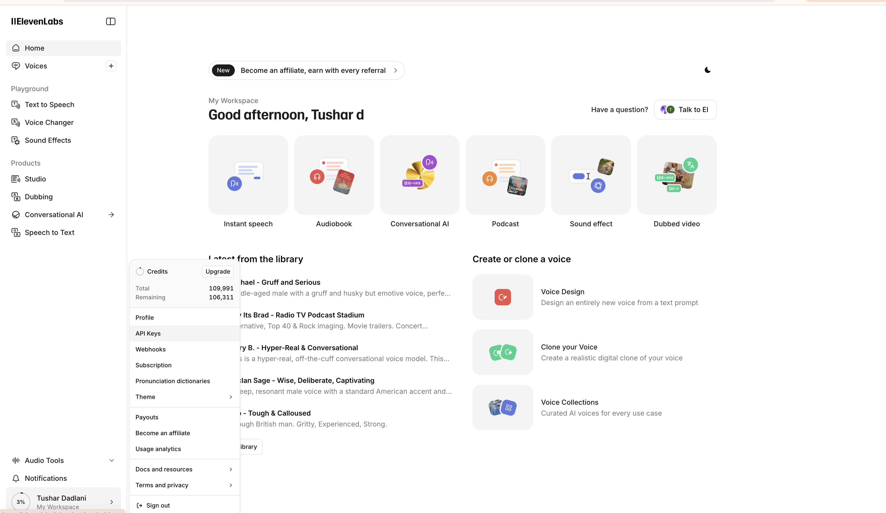
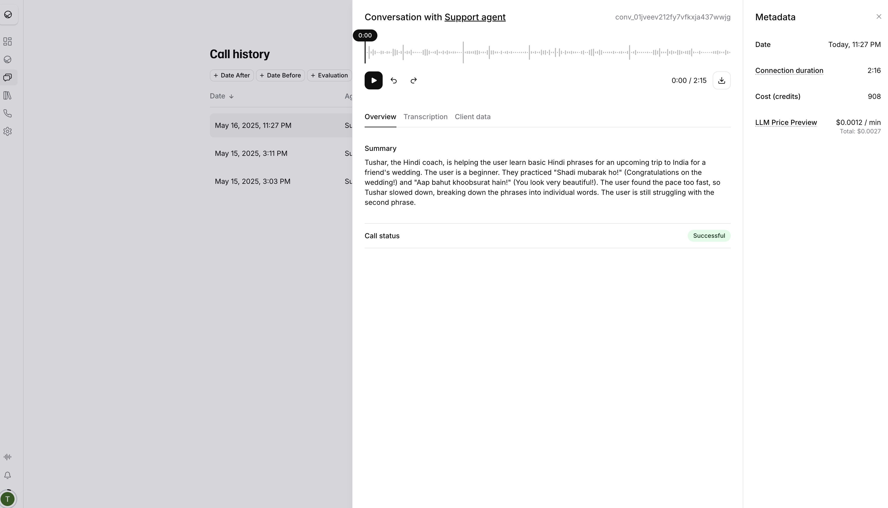
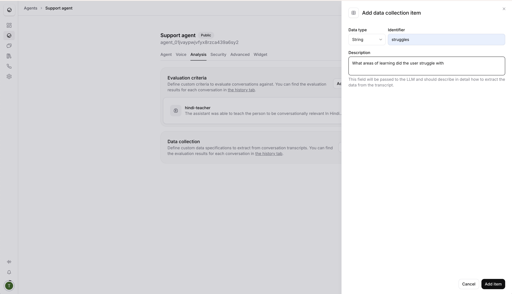
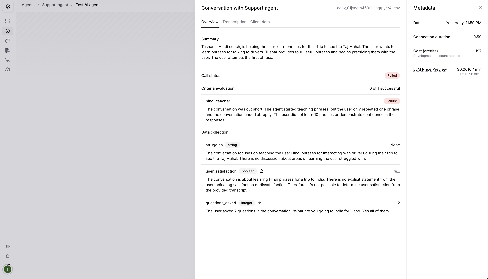

## Steps to setup

1. Using the Eleven Labs UI generate a conversational agent and an API Key.
    - The **API Key** can be found in your user profile section on the ElevenLabs dashboard.
    
    - The **Agent ID** is obtained once you create and configure your agent in the UI.

[Quick start](https://elevenlabs.io/docs/conversational-ai/quickstart)

2. **Environment Variables**:
   Create a `.env.local` file in the root of your project and add the following variables:
   ```
   XI_API_KEY=your_elevenlabs_api_key_here
   AGENT_ID=your_elevenlabs_agent_id_here
   ```
   - Replace `your_elevenlabs_api_key_here` with the API key obtained from your ElevenLabs profile.
   - Replace `your_elevenlabs_agent_id_here` with the ID of the agent you configured in the ElevenLabs UI (e.g., `agent_01jvaypwjvfyx8rzca439a6sy2`).

### Agent Setup in ElevenLabs UI
When configuring your agent in the ElevenLabs UI:
1. Use the default prompt as a template and generate a template by prompting ChatGPT to generate a template for "Teaching Hindi to an English speaker" (or your desired scenario).
1. Set the temperature to 0.5 to allow for some randomness and not too much 
1. Generate topics using a prompt to add to the topics that should be taught Example: "Can you help generate 10 topics that should help an English speaker visiting India learn basic Hindi to survive in Delhi?"
1. Generated prior curriculum and added it to the knowledge base for supporting the learning journey.
1. Cloned my own voice as I am a native Hindi speaker to use it as the voice of the AI.
1. Setup Evaluation criteria.
   
2. **Data Collection**: You can define custom data specifications to extract information from conversation transcripts. For example, you might set up a field like `struggles` (String type) to capture "What areas of learning did the user struggle with." This data can then be viewed in the conversation history and evaluation.
   
   

## Conversational AI Demo

Run the development server:

```bash
npm run dev
# or
yarn dev
# or
pnpm dev
# or
bun dev
```

## Learn More

- [Conversational AI Tutorial](https://elevenlabs.io/docs/product/introduction)
- [Conversational AI SDK](https://elevenlabs.io/docs/libraries/conversational-ai-sdk-js)
